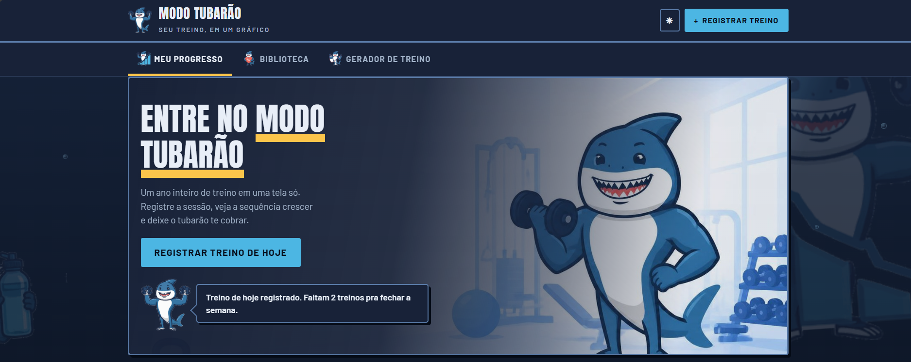
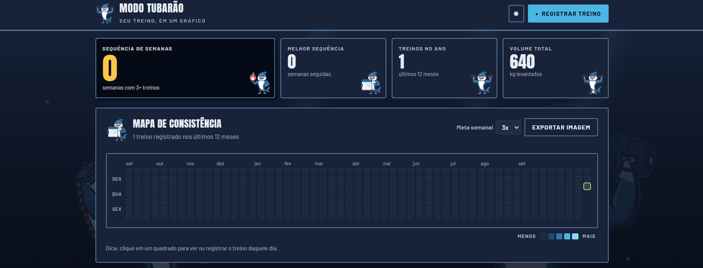
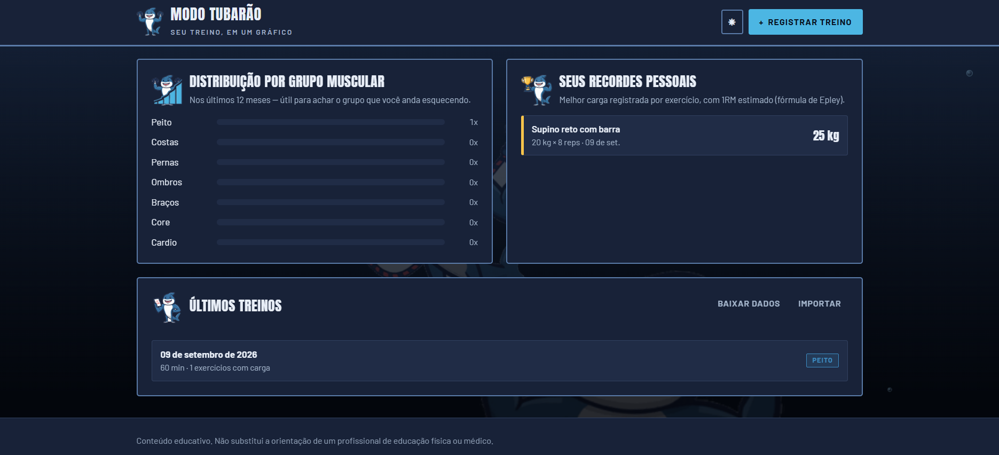
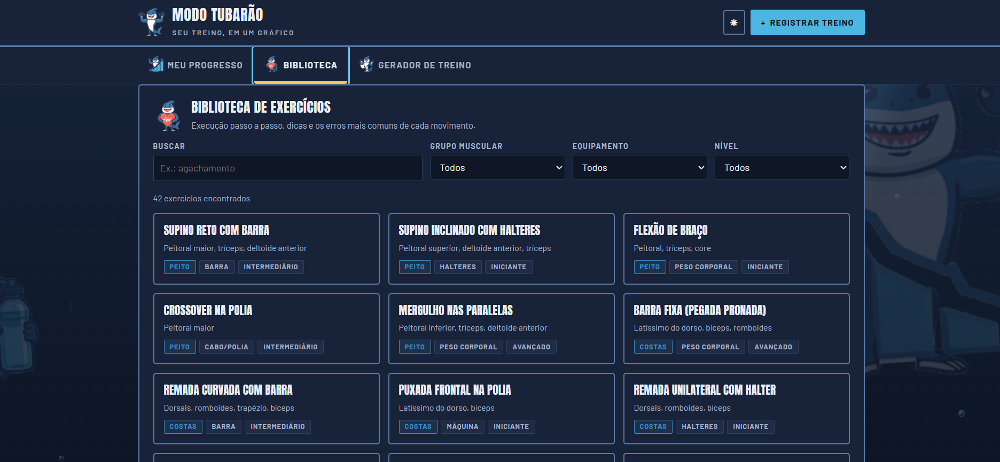
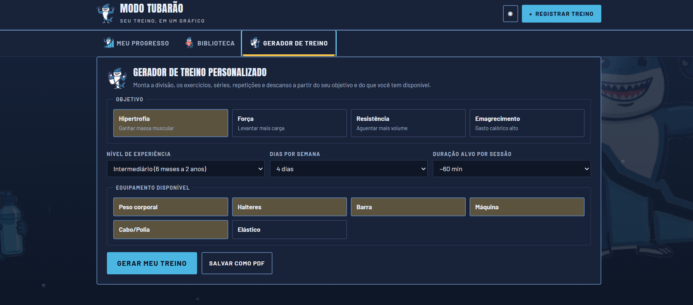

# Modo Tubarão 🦈

Um site para acompanhar seus treinos de academia. Você registra o treino do dia e ele vira um mapa de calor de um ano inteiro, igual ao gráfico de contribuições do GitHub — quanto mais escuro o quadrado, mais pesado foi o treino.

Feito com HTML, CSS e JavaScript puro. Sem instalação, sem cadastro e sem servidor.

## 🔗 Acesse o site

### **[Visualização](https://draciusjotan.github.io/ModoTubarao/)**

## Início

A porta de entrada. O tubarão avisa quantos treinos faltam para fechar a meta da semana, e o fundo é um oceano que escurece conforme você rola a página.



## Painel — mapa de consistência

Seus números do período e o ano inteiro de treinos em uma grade só. Clique em qualquer quadrado para registrar ou editar o treino daquele dia, e use **Exportar imagem** para gerar um cartão pronto para compartilhar.



## Painel — distribuição, recordes e histórico

Quais grupos musculares você anda treinando (e qual está esquecendo), seus recordes com 1RM estimado e os últimos treinos registrados. No fim ficam os botões de backup.



## Biblioteca de exercícios

42 exercícios com o passo a passo da execução, dicas e os erros mais comuns. Dá para filtrar por grupo muscular, equipamento e nível.



## Gerador de treino

Diga o objetivo, seu nível, quantos dias por semana treina e o equipamento que tem. O site monta a divisão da semana com séries, repetições e descanso — e dá para salvar em PDF.



---

## Como rodar

Baixe os arquivos e abra o `index.html` no navegador. Só isso.

Se preferir rodar com um servidor local:

```bash
python -m http.server 5599
```

E acesse `http://localhost:5599`.

## Seus dados

Tudo fica salvo no seu próprio navegador, então nada é enviado para lugar nenhum. Isso também significa que, se você limpar os dados do navegador, o histórico vai junto — por isso existem os botões de **baixar dados** e **importar** no fim da página. Use de vez em quando para ter um backup.

## Estrutura

```
index.html        página
css/style.css     estilos
js/               código (dados dos exercícios, mapa, biblioteca, gerador)
assets/           mascote, fontes e imagem de fundo
docs/             prints usados no README
```

## Aviso

O conteúdo é educativo e não substitui a orientação de um profissional de educação física ou médico.
